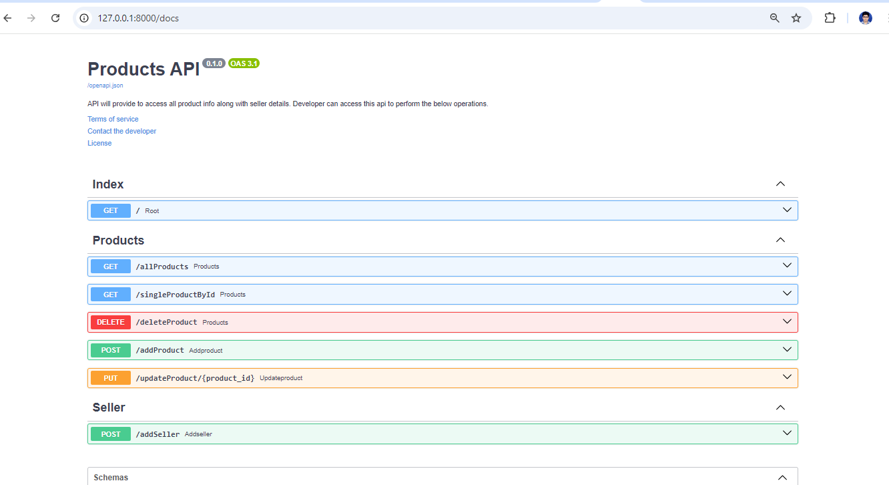

## Project Objective:
Develop a Product-Seller module using FASTAPI framework with OAuth2 validation. 
## Project Overview:
This project has been developed in FASTAPI Framework. There are two modules associated with this project(Like Product and Seller). JWT token creation and OAuth validation has been implemented
as a security features. SQLAlchemy and Pydantic module are backend database/orm technique to store and manipulate data flow over in the entire project.Additionally, the Router module has been added to make API more robust.

FASTAPI has its own auto-documentation feature which helps end programmer to reuse all API endpoints without any issue.

## Project Architecture:
This project has built on Python Version: 3.11.9 with the below packages. The project has been divided into multiple subpart/module to make it more robust.
1. login || product || seller → these three modules are present inside the router package which has been called explicitly from main.py.
2. database → This module has all details about database connection, DB Local Session creation.
3. schemas → This pydantic module contains all orm details and custom submodule creation.
4. models → This module has two different table creation details.
5. main → This is the start of the program.
6. .env → This file has all config details.

## Installation Guideline:
All the required packages have been listed inside 'requirements.txt' file.
* fastapi~=0.112.2
* sqlalchemy~=2.0.33
* uvicorn
* pydantic~=2.8.2
* starlette~=0.38.4
* bcrypt~=4.2.0
* passlib~=1.7.4
* python-jose~=3.3.0 
* python-dotenv~=1.0.1
* python-multipart~=0.0.9

Execute the below command in your active directory to install all packages for this project.
>> pip install -r requirements.txt
>  
>>python.exe -m pip install --upgrade pip
## Database Design:
This product API is using SQLAlchemy orm modules to handle all requests.
* Database Name : product.db
>> Table Used: 
> 1. ** products ** : This table is holding all product related information. "sellers.id" is the ForeignKey of product table. 
> 2. ** sellers **: This table is holding all seller information.
## Commits Details:
All the project commits have been drafted in the below-attached link.
https://github.com/sumantas98/MiniProjectFASTAPI/commits?author=sumantas98&since=2024-08-31&until=

## Additional Information & API Snippet:

## Execution Steps:
1. Create a new virtual environment.
2. Install all above packages along with python.
3. run the below command in cmd from project main directory else set up the entire project in pyCharm 
>> python.exe -m uvicorn Product.main:app --reload 