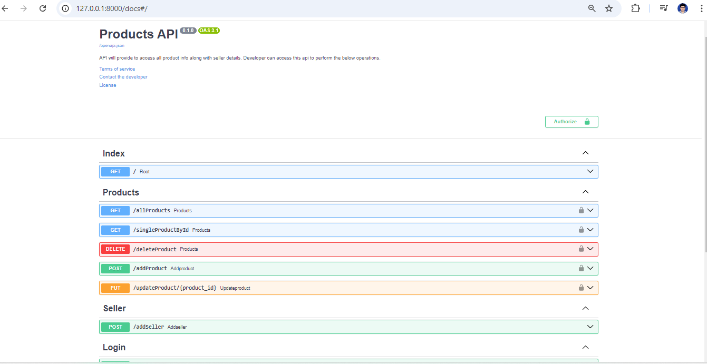

>The below project is still on development phase. Kindly ignore the missing details as of now.Thanks for your co-operation.

## Project Objective:

## Project Overview:

## Project Architecture:
* Python Version: 3.11.9

## Installation Guideline:
All the required packages has been listed inside 'requirements.txt' file.
* fastapi
* sqlalchemy
* uvicorn
* pydantic

Execute the below command in your active directory to install all packages for this project.
>> pip install -r requirements.txt
>  
>>python.exe -m pip install --upgrade pip
## Database Design:
This product API is using SQLAlchemy orm modules to handle all requests.
* Database Name : product.db
>> Table Used: 
> 1. ** products ** : This table is holding all product related information. "sellers.id" is the ForeignKey of product table. 
> 2. ** sellers **: This table is holding all seller information.
## Commits Details:
All the project commit has been drafted in the below attached link.
https://github.com/sumantas98/MiniProjectFASTAPI/commits?author=sumantas98&since=2024-08-31&until=

## Additional Information & API Snippet:

## TestCases:

## Mandatory Notes: